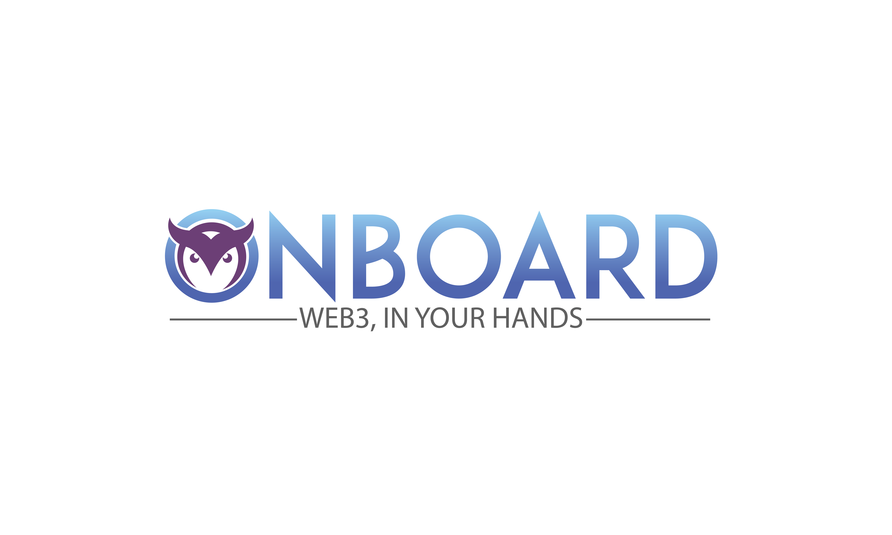

# Tech Used

**Polygon** - Our entire application runs on Polygon, currently on Polygon Mumbain testnet but soon to be on the Polygon Mainnet. The Smart contracts are deployed to the polygon mainnet.

**IPFS** - The NFTs and their metadeta are stored on IPFS where we use it to show our NFTs to secondary markets, currently Openseas Testnet

**Moralis** - Moralis is the backbone of our project from managing the data base, to authenticating users and storing user data, how many NFTs they posses. Moralis SDK enabled us to talk the the smart contracts from the frontend and finally it also helped in running cloud scripts.

### Onboard is a MetaFi game.

🧠 In itself, it is a DAO of DAOs. Its aim is to ensure functioning open
metaverse by onboard a community of gamers, learners, contributors and DAO
partners that understand the wide range of blockchain and societal issues and
develop the means to solve them through a satelite of DAOs. (LEARN/CONTRIBUTE)

💰 It’s a token of tokens. The protocol leverages DeFi capabilities by creating a DEX with BOARD
token we can leverae reputation based pools, that provide community members involved with governance, higher APR rates. 
The treasury will be backed by the tokens of different DAO partners that are
integrated into our platform. This allows our community to engage as a meta-governanor 
and act as a protocol politician for important decisions that affect our DAO partners. (EARN/GOVERN)

🎮 It’s a Metaverse of Metaverses. Onboard will use a simple but fun and
engaging metaverse to create an interoperable NFT game that allows users to
develop their on-chain skills in-game. The future vision is to keep the
metaverse lightweight in its graphics and mechanics to make it accessible to a
higher number of individuals from different socio-economic backgrounds.
(PLAY/EXPLORE)
